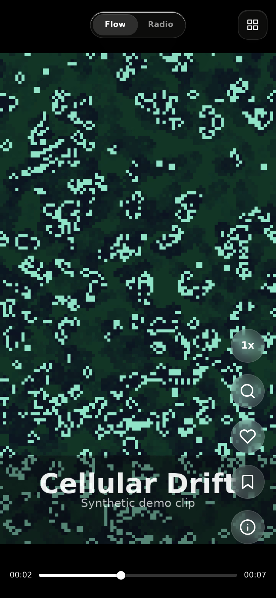
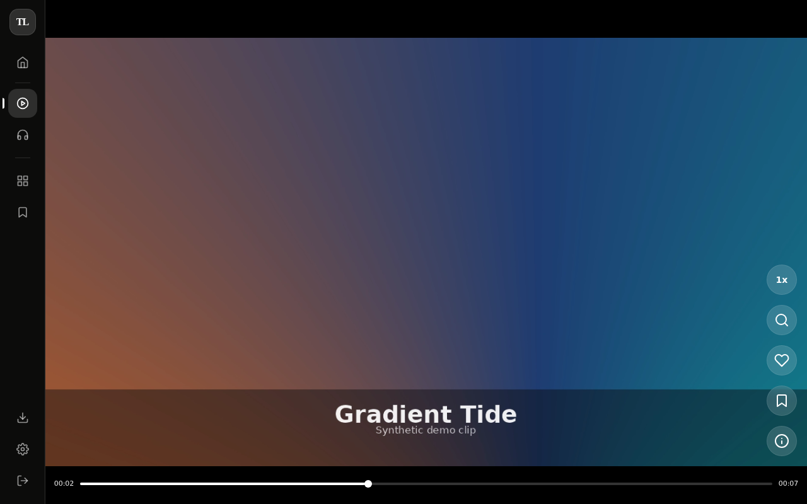
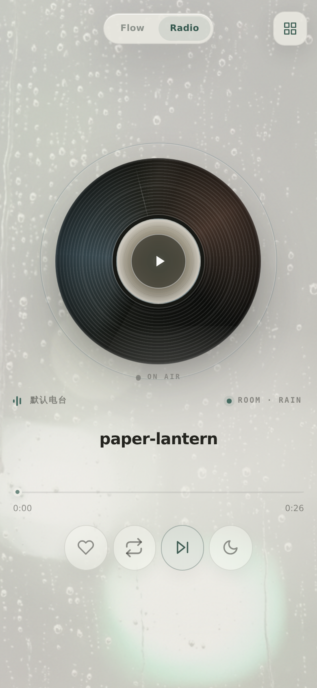
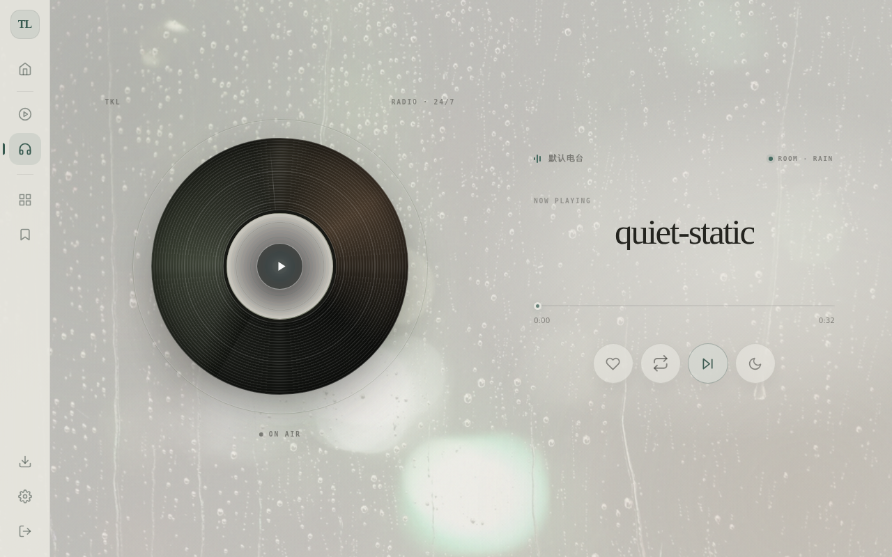
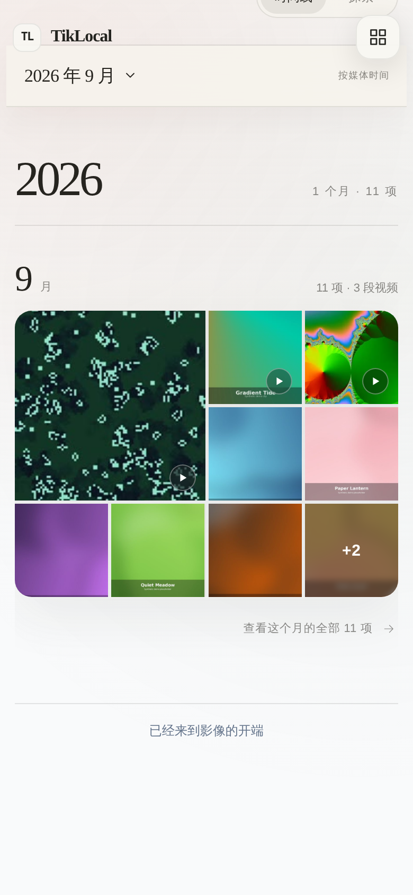
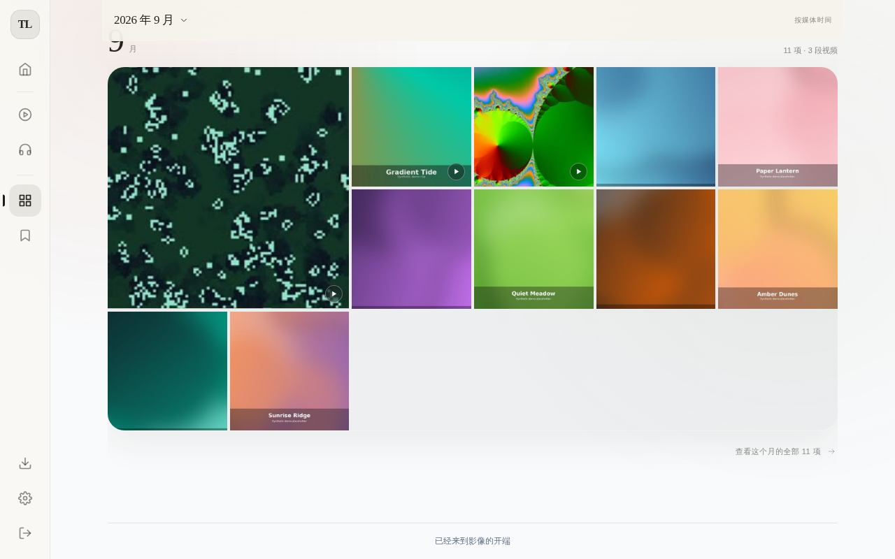

# TikLocal

**TikLocal** 是一个基于 **Flask** 的 **手机和 Pad 端** 的 **Web 应用程序**。它可以让您像Tiktok和Pinterest一样浏览和管理您的短视频和图片文件。

仓库还包含位于 `apps/radio`、当前工作品牌为 **LumaFold** 的本地优先 iPhone / Android 原生客户端：用户可以把
主动选择的照片和视频导入私有离线 Flow，无需账号、网络或 TikLocal Server；Radio
继续作为连接用户自有 Server 的可选能力。

[English](./README.md)

## 介绍

TikLocal 的主要功能包括：

* 提供类似 **Tiktok** 的 **上下滑动浏览** 体验，Flow 可混合浏览本地视频与图片。
* 提供类似 **普通文件管理器** 的 **目录浏览** 功能，让您可以方便地查找和管理本地短视频文件。
* 提供类似 **Pinterest** 的 **网格布局** 功能，让您可以欣赏本地图片。
* 支持基于本机媒体索引的 **搜索、收藏、集合与轻量推荐**。
* 支持按年/月浏览多年的媒体时间线，月份摘要按需加载代表影像，并可进入完整月份继续沉浸浏览。
* 支持多个媒体源与 URL 下载，并合并为一个统一的本地媒体库。
* 支持 **浅色和暗色模式**，满足您的个人喜好。

## 截图

TikLocal 以手机端体验为主，因此每个页面都先展示手机截图，桌面截图放在旁边作为参考。

### Flow —— 类 Tiktok 上下滑动流

　

*类似 Tiktok 的视频/图片混合滑动流，支持手动滑动切换与条内操作。*

### Radio —— 氛围电台播放器

　

*带黑胶唱片可视化效果的氛围音频播放器，支持房间背景（雨声/微风）与本地曲目列表。*

### Library —— 类 Pinterest 网格 + 时间线

　

*以年/月时间线组织的 Pinterest 式网格布局，方便浏览多年积累的媒体库。*

> **说明：** 以上截图中展示的内容（渐变色图片、抽象动态片段与氛围音效）均为仅用于生成截图的合成示例素材，并非作者的真实文件；TikLocal 本身不会附带或要求任何内置媒体库。

## 使用场景

TikLocal 适用于以下场景：

* 您不相信Tiktok的青少年模式, 想给你的小孩提供完全可控的短视频内容。
* 您想在本地浏览和管理您的短视频和图片文件，但不想使用第三方云服务。
* 您想在手机或 Pad 上使用 Tiktok 式的视频+图片混合浏览体验。
* 您想在手机或 Pad 上使用 Pinterest 式的图片浏览体验。

## 如何使用

### 安装

TikLocal 是一个Python应用程序，您可以通过以下方式安装：

```
pip install tiklocal
```

默认安装提供 HTTP 服务，也适用于 Android/Termux。HTTPS 由外部反向代理提供。

### 使用

TikLocal 的启动非常简单，只需执行以下命令：
```bash
tiklocal ~/Videos/
```
您可以指定任意的媒体文件夹

想要关闭时, 使用`Ctrl + C`

#### 命令行工具

TikLocal 提供了多个 CLI 命令：

**启动服务器：**
```bash
tiklocal /path/to/media           # 指定媒体目录启动
tiklocal --port 9000              # 使用自定义端口
tiklocal --media-source photos=~/Pictures/AI  # 追加媒体源，可重复
```

**浏览器访问与 HTTPS：**

直接在浏览器打开 TikLocal。PWA 安装、离线资源缓存、内置 HTTPS 和本地证书管理已移除，媒体与已有业务数据保持不变。

如需 HTTPS，由外部反向代理管理证书，再转发到 TikLocal 的 HTTP 服务：

```bash
FLASK_AUTH_COOKIE_SECURE=true tiklocal ~/Videos --host 127.0.0.1 --port 8000 --name "书房 Mac"
```

代理应保留原 Host 和媒体 Range 请求。只有通过 HTTPS 访问时才启用安全 Cookie；直接使用局域网 HTTP 时不设置该变量，并按需选择监听网卡。

升级时请移除 YAML 中的 `https`、`tls_cert`、`tls_key`、`hostnames`。仍启用的旧 TLS 配置会阻止启动，避免悄悄降级为 HTTP；旧 `--https`、`--tls-cert`、`--tls-key`、`--hostname` 参数、`tls` 命令和 `[https]` 安装选项不再支持。`~/.tiklocal/tls/` 里的已有证书与系统信任记录不会被自动删除。

已安装的桌面入口可手动移除。重新访问原地址时，会清理该来源下 TikLocal 的旧缓存和注册；浏览器不能跨来源清理旧地址的数据。`/service-worker.js` 仅保留为旧安装的退出入口，新页面不再注册缓存服务，普通浏览器 HTTP 缓存仍可用。

**访问认证：**

认证默认启用。首次启动时，TikLocal 会在终端打印自动生成的访问密码。所有页面、API、媒体文件和管理操作都需要先登录；登录后可使用全部功能。

```bash
tiklocal auth status              # 查看认证状态和存储路径
tiklocal auth set-password        # 修改密码，并使已有登录会话失效
TIKLOCAL_AUTH_PASSWORD='一个足够长的私人密码' tiklocal auth set-password
```

密码只以 scrypt 哈希存放在 `~/.tiklocal/auth.json`，不会明文落盘。仍建议仅在可信内网使用；若通过 HTTPS 反向代理对外提供访问，请设置 `FLASK_AUTH_COOKIE_SECURE=true`，使浏览器只通过 HTTPS 发送会话 Cookie。

**生成视频缩略图：**
```bash
tiklocal thumbs /path/to/media    # 生成缩略图
tiklocal thumbs /path --overwrite # 重新生成已有的缩略图
```

CLI 与 Web 按媒体来源 URI 共用缩略图缓存，默认来源的有效旧缓存仍可读取。
CLI 优先尝试视频时长约 20% 处，Web 保留原有固定时间点回退；生成失败保留已有缓存。

**查找和清理重复文件：**
```bash
tiklocal dedupe /path/to/media              # 查找重复文件（预演模式）
tiklocal dedupe /path --type video          # 仅检查视频文件
tiklocal dedupe /path --execute             # 执行删除
tiklocal dedupe /path --keep newest         # 保留最新的文件
```

`dedupe` 命令选项：
- `--type`: 文件类型（`video`、`image`、`all`）
- `--algorithm`: 哈希算法（`sha256`、`md5`）
- `--keep`: 保留策略（`oldest`=最早、`newest`=最新、`shortest_path`=路径最短）
- `--dry-run`: 预演模式（默认）
- `--execute`: 执行实际删除
- `--auto-confirm`: 跳过确认提示

### URL 下载（Web）

TikLocal 新增了 `/download` 页面，可粘贴媒体 URL 并创建后台下载任务。

依赖要求：
- `yt-dlp`（必需）
- `gallery-dl`（建议，用于图片帖/图集）
- `ffmpeg`（建议，用于格式合并）

下载引擎说明：
- `yt-dlp`：更适合视频链接
- `gallery-dl`：更适合图片帖与图集（如 Instagram/X/Pinterest）
- 下载表单支持按任务手动选择引擎（默认 `yt-dlp`）

登录态内容（可选）：
- 将导出的 cookie 文件放到 `~/.tiklocal/cookies`
- 文件名建议包含域名，例如 `x.com.txt`、`youtube.com.cookies`
- 下载页面支持“自动匹配”或按任务手动指定 cookie 文件
- 下载页面也支持凭据文件上传/覆盖、历史删除/清空，以及失败任务重试

安装示例：
```bash
# macOS (Homebrew)
brew install yt-dlp gallery-dl ffmpeg

# Ubuntu / Debian
sudo apt install yt-dlp gallery-dl ffmpeg
```

### 首页与 Flow

首页（`/`）是选择 Flow 或 Radio、查看最近媒体、重新发现图片和进入个人集合的安静入口。混合沉浸流位于 `/flow`：

- 视频与图片在同一条滑动流中混排（视频主导密度，顺序随机化）
- 图片条目支持 AI 标题/标签面板（站内生成与展示）
- 图片条目支持圆形放大镜（2.5x / 5x）
- 图片条目不自动跳转，需手动滑动切换

### 媒体时间线

媒体库默认以年/月时间线呈现图片与视频。每个月仅加载一组稳定的代表缩略图，手机最多展示 9 项、较大屏幕最多展示 15 项；进入月份后可查看全部内容并继续使用 Quick Viewer、收藏与集合操作。

时间线优先读取图片 EXIF 拍摄时间，其次识别文件名中的日期，最后回退到文件修改时间。TikLocal 会把解析结果写入本地 SQLite 索引，未变化文件不会在每次启动时重复读取元数据。随机图片、最新视频与大文件入口保留在“探索”视图中；相似图片改为独立实验页面。

### 配置

TikLocal 提供了一些配置选项，您可以根据自己的需要进行调整。

可以在 `~/.config/tiklocal/config.yaml` 中配置一个或多个媒体目录：

```yaml
media_sources:
  - id: default
    name: 主媒体库
    path: ~/Videos/TikLocal
  - id: photos
    name: 图片库
    path: ~/Pictures/AI
download_source: default
name: 书房 Mac
port: 8000

vision:
  enabled: true
  base_url: https://openrouter.ai/api/v1
  model_name: google/gemini-2.5-flash
  temperature: 0.6
  tags_limit: 5
  system_prompt: |
    你是图片内容分析助手。只输出 JSON。
  user_prompt: |
    请分析这张图片，生成一个简短中文标题，并给出最多 {tags_limit} 个中文标签。
    输出 JSON：{"title":"...","tags":["..."]}

experiments:
  similarity:
    enabled: true

embedding:
  enabled: true
  base_url: https://openrouter.ai/api/v1
  model_name: google/gemini-embedding-2
  dimensions: 768
  image_max_size: 512
  image_quality: 82
```

也可以继续使用旧的单目录配置：

```yaml
media_root: ~/Videos/TikLocal
```

多媒体源会合并为一个统一媒体库，内部媒体 URI 使用 `@source_id/path` 格式；旧的裸路径链接和收藏会自动兼容到 `@default/...`。

图片识别使用 `vision` 配置；图片向量化使用 `embedding` 配置，并把图片向量存入本地 SQLite 应用数据库（默认 `~/.tiklocal/tiklocal.sqlite3`）。图片详情页只读取本地索引用于相似图片推荐；构建或更新向量请使用 CLI：

```bash
tiklocal vectorize ~/Videos/TikLocal --limit 200 --order latest
tiklocal vectorize ~/Videos/TikLocal --dry-run
tiklocal analyze-similar ~/Videos/TikLocal --limit 500 --yes
```

`experiments.similarity.enabled` 是实验及相关 CLI 的启动总开关。显式设为 `false` 会关闭功能并保留已有向量和分组；未设置时，兼容有效的旧 `embedding.enabled: true`，已保存的 `embedding_config.json` 优先于 YAML 配置。仅有旧向量数据不会自动启用，请显式开启新开关查看这些结果。修改总开关后需重启服务。

仅查看结果时，开启实验并将有效的 `embedding.enabled` 设为 `false`；构建向量仍需 `embedding.enabled: true`。CLI 配置优先级为默认值 < YAML < 已保存向量配置 < 本次命令参数。先用 `--dry-run` 和有限的 `--limit` 预览，费用未知；查看结果不会调用模型。同步 Web 全库构建已停用，`POST /api/ai/embedding-index/run` 返回 410 和 CLI 指引（实验关闭时为 404）。

API Key 通过环境变量读取：图片识别优先使用 `TIKLOCAL_VISION_API_KEY`，图片向量优先使用 `TIKLOCAL_EMBEDDING_API_KEY`，之后回退到 `TIKLOCAL_AI_API_KEY`、`OPENAI_API_KEY` 或 `OPENROUTER_API_KEY`。

### 服务与下载生命周期

普通 CLI 启动会管理下载器的启动和关闭。Ctrl+C 或 SIGTERM 正常退出时取消未完成任务、停止下载进程并保留已有文件；异常退出留下的任务仍按中断失败处理，不自动续传。

自定义 WSGI 宿主使用 `create_app()` 时，在实际服务 worker 中调用 `app.extensions['download_manager'].start()`，在退出/finally 钩子中调用 `.close()`，不要放在 Flask 每次请求的 teardown 中。仅构造应用不会启动下载线程，启动管理器后才可提交任务。每个数据目录由一个服务实例管理。

### 图片向量化 CLI

批量向量化建议使用命令行，先预览再小批量执行：

```bash
tiklocal vectorize /path/to/media --dry-run
tiklocal vectorize /path/to/media --limit 200 --order latest
tiklocal vectorize /path/to/media --source photos --limit 200
tiklocal vectorize /path/to/media --cleanup
tiklocal vectorize /path/to/media --max-size 512 --quality 82
tiklocal analyze-similar /path/to/media --limit 500 --yes
tiklocal analyze-similar /path/to/media --profile --dry-run
```

推荐流程：

- 先运行 `--dry-run`，查看总图片数、已索引、缺失、过期和本次将处理的数量。
- 首次低成本执行可用 `--limit 200 --order latest`，先处理最新 200 张。
- 多媒体源场景可用 `--source <id>` 只处理某个媒体源。
- 文件删除或移动后，用 `--cleanup` 清理失效向量。
- 只有明确要重建已有向量时才使用 `--force`。
- 自动化脚本可加 `--yes` 跳过确认提示。

`vectorize` 只会上传缺失或过期的图片。文件大小、修改时间、模型、维度、`image_max_size` 或 `image_quality` 变化时，已有向量会被视为过期。发送前图片会处理 EXIF 方向、缩放、重新编码为 JPEG，并且不会携带原始 EXIF/ICC/XMP/IPTC metadata。

向量构建完成后，运行 `analyze-similar` 可把视觉相似组预生成到 SQLite。图片详情页会直接读取本地向量查询相似图片；独立的 `/experiments/similarity` 页面只读取预生成分组。启用后从设置页进入，旧 Library 相似链接会跳转到该页。

* 浅色模式/暗色模式：您可以选择使用浅色模式或暗色模式。
* 视频播放速度：您可以调整视频播放速度。

## 文档

- 文档索引：`docs/README.md`
- 媒体索引与本地推荐架构：`docs/media-index-and-recommendation.md`
- 原生 App 本地优先架构：`docs/native-local-app-architecture.md`
- 版本记录：`docs/release_notes.md`


## TODO

* [ ] 增加更多管理操作, 比如移动文件, 创建文件夹
* [x] 增加基础的登录控制
* [ ] 增加Docker镜像
* [ ] 增加标签功能

## 贡献

TikLocal 是一个开源项目，您可以通过以下方式进行贡献：

* 提交代码或文档的改进。
* 报告 Bug。
* 提出新功能的建议。

## 联系我们

如果您有任何问题或建议，可以通过以下方式与我们联系：

* GitHub 项目地址：[https://github.com/ChanMo/TikLocal/](https://github.com/ChanMo/TikLocal/)
* 邮箱：[chan.mo@outlook.com]
